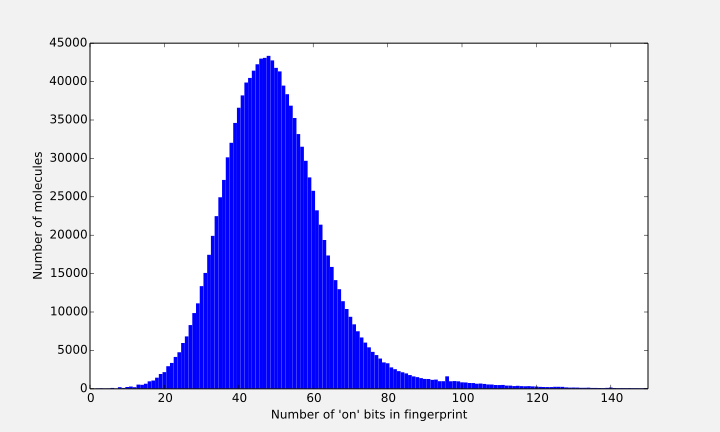
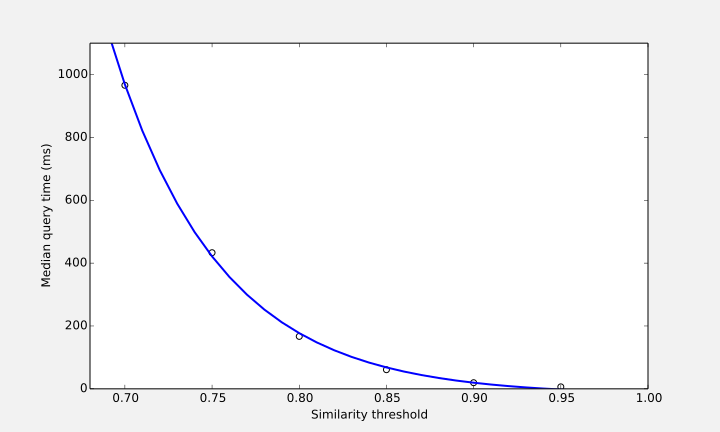
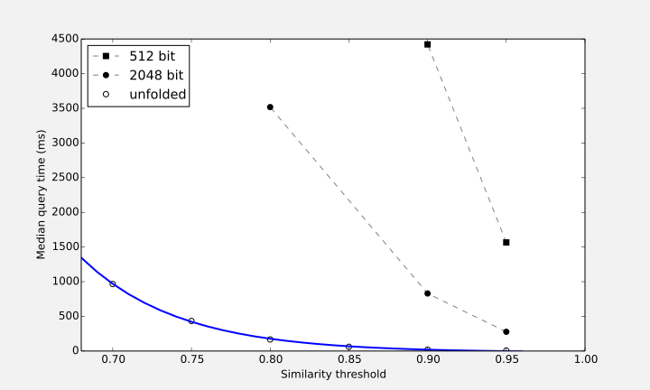
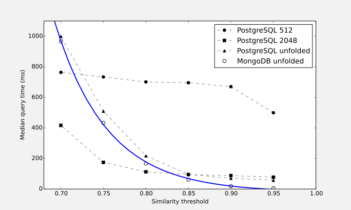

I’ve long been curious about implementing chemical searches in MongoDB, and [Rajarshi Guha’s recent blog post][rg1] about it prompted me to give it a go as well. A while back I too came across the fantastic series of blog posts by Davy Suvee at Datablend ([part 1][db1], [part 2][db2], [part 3][db3]), and even now they seem to be the only good discussion about implementing chemical searches in MongoDB that I can find.

Despite Davy’s bold claims of “millisecond time” queries, Rajarshi found the query performance disappointingly slow. I thought I’d do some benchmarks of my own, and compare the results with the [RDKit PostgreSQL chemical cartridge][rdkitpg], a traditional SQL chemical database solution. All the source code is available in a Github repository called [mongodb-chemistry][source].


[rg1]: http://blog.rguha.net/?p=1261
[db1]: http://datablend.be/?p=254
[db2]: http://datablend.be/?p=256
[db3]: http://datablend.be/?p=265
[rdkitpg]: http://www.rdkit.org/docs/Cartridge.html
[source]: https://github.com/mcs07/mongodb-chemistry

## Populating The MongoDB Database

Seeing as I want to compare performance with the RDKit PostgreSQL cartridge, it makes sense to use RDKit in MongoDB too.  For the test data, I just downloaded the latest ChEMBL release as an SDF ([chembl_18.sdf][chembl]), and imported it into a MongoDB collection using python:

```python
db = pymongo.MongoClient().chem

for rdmol in Chem.ForwardSDMolSupplier('chembl_18.sdf'):
    if rdmol is None: continue
    db.molecules.insert({
        'smiles': Chem.MolToSmiles(rdmol, isomericSmiles=True),
        'chembl_id': rdmol.GetProp('chembl_id'),
        'rdmol': Binary(rdmol.ToBinary()),
    })
```

For each molecule in the SD file, this script inserts a document containing the ChEMBL ID, the canonical isomeric SMILES and a pickle of the RDKit Mol object. Storing the pickle makes it easy to load the molecules into RDKit again after retrieving them from the database, without having to go through the inefficient and unavoidably lossy process of converting to a format like SMILES and back again. This is important because it allows us to add extra calculated or derived data (such as fingerprints) to the database at a later time. In total, 1,352,378 molecules were successfully imported from ChEMBL.

[chembl]: ftp://ftp.ebi.ac.uk//pub/databases/chembl/ChEMBLdb/releases/chembl_18/chembl_18.sdf.gz

## Chemical Similarity basics

In practice, efficient calculation of the [similarity][chemsim] of any two molecules is achieved using molecular fingerprints that encode structural information about the molecule as a series of bits (0 or 1). Typically these bits represent the presence or absence of particular patterns or substructures — two molecules that contain more of the same patterns will have more bits in common, indicating that they are more similar. The most commonly used measure for quantifying the similarity of two fingerprints is the [Tanimoto (a.k.a. Jaccard) coefficient][tanimoto], given by:

$$
T = \frac{N_{ab}}{N_{a} + N_{b} - N_{ab}}
$$

where $N_{a}$ and $N_{b}$ are the number of 'on' fingerprint bits (i.e corresponding to the presence of a pattern) in the fingerprints of molecule $a$ and molecule $b$ respectively. $N_{ab}$ is the number of fingerprint bits common to the fingerprints of both molecule $a$ and $b$. The Tanimoto coefficient ranges from 0 when the fingerprints have no bits in common, to 1 when the fingerprints are identical.


[chemsim]: http://en.wikipedia.org/wiki/Chemical_similarity
[tanimoto]: http://en.wikipedia.org/wiki/Jaccard_index

## Generating Fingerprints

[Morgan (a.k.a. circular) fingerprints][morgan] are an [ECFP][ecfp]-like family of fingerprints that RDKit can generate [^1]. Instead of being based on bits that correspond to a fixed set of predefined substructural keys, ECFPs consist of integer codes that are generated using a hashing procedure from the local environments around each atom in multiple circular layers up to a given radius [^2]. Given a radius (e.g. 2), RDKit will return a Morgan fingerprint as a count vector that consists of a list of unique integers codes, each with a count that corresponds to the number of times the corresponding substructure occurs in the molecule:

```python
mfp = AllChem.GetMorganFingerprint(rdmol, 2)
```

While this is the most information-rich representation of this fingerprint, there are two things to note:

Firstly, each fingerprint consists of typically less than 100 integer codes that are sparsely mapped over a vast space of $2^{32}$ possible integers. Storing these in the database as explicit bit vectors would be hugely inefficient and impractical (impossible?), so RDKit also has the ability to fold the fingerprints down to a fixed length bit vector [^3]. Fortunately, for our purposes it is actually preferable to store the fingerprints in MongoDB as an array of just the ‘on’ bit positions, negating most of the problems with sparse fingerprints and making it possible to use unfolded fingerprints. Nevertheless, it is worth investigating the impact that folding has on both query performance and quality of the query results.

Secondly, it’s worth considering how best to use the count information associated with each integer code. For now, I have just discarded this information and treated the fingerprint as a traditional on/off bit vector. However, it shouldn’t be too difficult to retain and use this information when calculating similarities. I expect this could improve the quality of the query results, but could potentially have a negative impact on query performance.

Figure 1 shows the distribution of the number of ‘on’ bits in the fingerprint for each molecule calculated for the entire ChEMBL database. Folded fingerprints show similar distributions, but with slightly lower mean values due to collisions where two or more different integer codes get folded onto the same bit position in the smaller fixed range (The mean is 50.1 for unfolded, 49.4 for 2048 bits, 47.6 for 512 bits).

{.large}

[^1]: For comparison, Davy used [jCompoundMapper][jcm] to calculate a Molprint2D fingerprint, and Rajarshi used the [CDK][cdk] to calculate a Signature fingerprint.
[^2]: ChemAxon have a [good page explaining how extended-connectivity fingerprints work][chemaxon].
[^3]: Values of 512, 1024 and 2048 are typical for fixed length folded fingerprint bit vectors.


[morgan]: http://www.rdkit.org/docs/GettingStartedInPython.html#morgan-fingerprints-circular-fingerprints
[ecfp]: http://dx.doi.org/10.1021/ci100050t 
[chemaxon]: http://www.chemaxon.com/jchem/doc/user/ECFP.html

[jcm]: http://jcompoundmapper.sourceforge.net
[cdk]: https://github.com/cdk/cdk

## Similarity Search in MongoDB: A Naïve Approach

The basic objective of chemical similarity searching tasks is to find molecules in a database that are most similar to a given query molecule. Most simply, this involves finding molecules with a similarity to the query molecule over a certain threshold. One could implement this naïvely as follows:

```python
qfp = list(AllChem.GetMorganFingerprintAsBitVect(qmol, 2, nBits=2048).GetOnBits())
for molecule in db.molecules.find():
    dbmol = Chem.Mol(molecule['rdmol'])
    mfp = list(AllChem.GetMorganFingerprintAsBitVect(dbmol, 2, nBits=2048).GetOnBits())
    intersection = len(set(qfp) & set(mfp))
    tanimoto = float(intersection) / (len(mfp) + len(qfp) - intersection)
    if tanimoto > threshold:
        print '%s : %s : %s' % (tanimoto, molecule['chembl_id'], molecule['smiles'])
```

This calculates a fingerprint for the query molecule, then iterates through the entire database, calculating the fingerprint for each molecule and the Tanimoto coefficient of that fingerprint with the query fingerprint, returning those where the Tanimoto coefficient is above the threshold. Whilst simple, this approach is impracticably slow on any sizeable database, taking many minutes for a single query. Fortunately there are some efficiency tricks we can use to speed things up.


## Improving Search Efficiency

Most obviously, we can pre-calculate the fingerprint for every molecule in the database so it doesn't have to be redundantly calculated every time a search is performed. The same goes for the total number of bits in the fingerprint (i.e. $N_{b}$, needed to calculate the Tanimoto coefficient):

```python
for molecule in db.molecules.find():
    rdmol = Chem.Mol(molecule['rdmol'])
    mfp = list(AllChem.GetMorganFingerprintAsBitVect(rdmol, 2, nBits=2048).GetOnBits())
    molecule['mfp'] = {'bits': mfp, 'count': len(mfp)}
    db.molecules.save(molecule)
```

There are two further efficiency tricks that work by placing constraints on easily searchable properties of fingerprints to filter out the most obviously unsuitable molecules before going through the expensive process of calculating the exact Tanimoto coefficient [^4]:

1. Given a query fingerprint with $N_{a}$ bits, any molecule in the database must have $N_{b}$ bits within the range $TN_{a} \leqslant N_{b} \leqslant \frac{N_{a}}{T}$ to have a similarity above a threshold $T$. This is because if the number of bits in each fingerprint differ by too much, it would be impossible for the similarity to be above the threshold even in the most ideal case where one fingerprint is an exact subset of the other.

2. Out of any $N_{a} - TN_{a} + 1$ bits chosen at random from the query fingerprint $a$, at least one must be present in any other fingerprint $b$ to achieve a similarity above the threshold $T$. This is because even if all the remaining other $TN_{a} - 1$ bits are in common, it still would not be enough for the similarity to be above the threshold (as shown by the previous constraint). 

For the second constraint, the bits chosen from the query fingerprint don’t actually need to be random — in fact, we can optimise even further by ensuring we choose the rarest fingerprint bits, thus restricting the query set as much as possible. However, this does mean we need to know how rare or common each fingerprint bit is in the entire molecule collection. We can do this by building an additional fingerprint counts collection, which ideally should be updated periodically if the main molecules collection changes:

```python
counts = {}
for molecule in db.molecules.find():
    for bit in molecule['mfp']['bits']:
        counts[bit] = counts.get(bit, 0) + 1
for k, v in counts.items():
    db.mfp_counts.insert({'_id': k, 'count': v})
```

This produces a collection called `mfp_counts` with documents that have a `count` field and an `_id` that corresponds to the fingerprint bit.

Finally, MongoDB query performance can be improved by adding an index on the specific fields that will be queried, in this case the fingerprint bits and counts:

```python
db.molecules.ensure_index('mfp.bits')
db.molecules.ensure_index('mfp.count')
```

Combining all these efficiency tricks, the previous naïve approach can be improved considerably:

```python
qn = len(qfp)
qmin = int(qn * threshold)
qmax = int(qn / threshold)
reqbits = [count['_id'] for count in db.mfp_counts.find({'_id': {'$in': qfp}}).sort('count', 1).limit(qn - qmin + 1)]
for molecule in db.molecules.find({'mfp.bits': {'$in': reqbits}, 'mfp.count': {'$gte': qmin, '$lte': qmax}}):
    intersection = len(set(qfp) & set(molecule['mfp']['bits']))
    pn = molecule['mfp']['count']
    tanimoto = float(intersection) / (pn + qn - intersection)
    if tanimoto > threshold:
        print '{} : {} : {}'.format(tanimoto, molecule['chembl_id'], molecule['smiles’])
```

[^4]: For more information on deriving these constraints and using them to speed up similarity searches, see [this 2007 JCIM paper by Swamidass and Baldi][swamidass2007] and [Davy’s blog post on Datablend][db1].

[swamidass2007]: http://dx.doi.org/10.1021/ci600358f

## The MongoDB Aggregation Framework

One issue with the query method outlined above is that most of the time-consuming work is performed by the client rather than the database server. The server performs the initial filtering stages, but then just sends thousands of molecules over to the client to calculate the exact similarities and produce the actual results. This makes the overall performance mostly dependent on the speed of the client or application server, and also has the potential for a network bottleneck when transferring such a huge amount of data for each query.

The solution to this problem is to use the MongoDB aggregation framework, which allows a pipeline of tasks to be performed on the MongoDB server. This way, the MongoDB server does all the work and only the actual query results are sent to the client.

In his [blog post at Datablend][db3], Davy proposed an aggregation pipeline for similarity searching that Rajarshi found to be disappointingly slow in [his benchmarks][rg1]. However, in the time since Davy wrote his blog post, MongoDB version 2.6 introduced some new aggregation features that may have better performance. Of particular interest is the `$setIntersection` operator, which is exactly what we need to calculate the number of bits in common between two fingerprints. 

Here’s a similarity search aggregation pipeline that uses these new features:

```python
qn = len(qfp)
qmin = int(qn * threshold)
qmax = int(qn / threshold)
reqbits = [count['_id'] for count in db.mfp_counts.find({'_id': {'$in': qfp}}).sort('count', 1).limit(qn - qmin + 1)]
aggregate = [
    {'$match': {'mfp.count': {'$gte': qmin, '$lte': qmax}, 'mfp.bits': {'$in': reqbits}}},
    {'$project': {
        'tanimoto': {'$let': {
            'vars': {'common': {'$size': {'$setIntersection': ['$mfp.bits', qfp]}}},
            'in': {'$divide': ['$$common', {'$subtract': [{'$add': [qn, '$mfp.count']}, '$$common']}]}
        }},
        'smiles': 1,
        'chembl_id': 1
    }},
    {'$match':  {'tanimoto': {'$gte': threshold}}}
]
response = db.molecules.aggregate(aggregate)
for result in response['result']:
    print '%s : %s : %s' % (result['tanimoto'] * 100, result['chembl_id'], result['smiles'])
```

## Benchmarks

I ran benchmarks by using 1000 random molecules from the database as query molecules and taking the median query time. Figure 2 shows the median query time using the above aggregation method with an unfolded Morgan fingerprint for different similarity thresholds. It illustrates how lower thresholds take longer as the fast initial filtering stages can’t rule out as many molecules before the exact similarities are calculated. Queries take around 19 ms for a threshold of 0.9, but this increases to 966 ms for a threshold of 0.7.

{.large}

### Effect of Fingerprint Size

I also ran similar benchmarks with the Morgan fingerprint folded to fixed lengths of 512 and 2048. While these fixed bit vector style fingerprints generally seem to be more commonly used, it’s clear that the unfolded fingerprint performs best in MongoDB. As shown in figure 3, at a threshold on 0.9, the 2048 bit fingerprint has a median query time of 829 ms and the 512 bit fingerprint was even worse at 4422 ms.

This performance difference is primarily due to the constraint that requires at least one of any $N_{a} - TN_{a} + 1$ bits chosen from the query fingerprint $a$ to be present in the result fingerprints. The unfolded fingerprint has far more different unique bits (486,769 in ChEMBL, compared to 2048 or 512 for the fixed fingerprints), but doesn’t have a significant difference in the average number of bits on each molecule (so $N_{a}$ is roughly the same). As a result, constraining the query to only fingerprints that contain at least one of $N_{a} - TN_{a} + 1$ bits chosen from the query fingerprint allows us to filter down to a much smaller subset.

The fixed length fingerprints are also worse in terms of the quality of the query results. For shorter fingerprints, similarity values tend to be overestimated due to bit collisions. This increases the number of "false positives" in the query results, especially at a length of 512 bits.

{.large}

### Effect of Hardware Setup

The tests were run on a MacBook Pro with a 2.7 GHz 2-core Intel Core i7 processor, 16 GB of RAM and a Samsung 840 EVO SSD. I briefly had access to a faster setup (Mac Pro with a 3.5GHz 6-core Xeon E5 processor, 64 GB of RAM and an Apple SSD), and saw marginal improvements in the few benchmarks I was able to run [^5].

In production, MongoDB would typically be [sharded][sharding] over multiple servers to give further performance improvements. Sharding helps solve one of the most important hardware considerations for MongoDB performance — the ability to store the entire “working set” in memory. If this isn’t the case, performance becomes limited by the I/O capacity of the SSD [^6]. The 16 GB of RAM in my MacBook Pro was more than sufficient for ChEMBL, but I expect larger PubChem-scale databases would even push the limits of the 64 GB of RAM in the Mac Pro. Sharding addresses this through horizontal scaling so each server only needs to store a portion of the database in RAM. On top of this, sharding improves concurrency through additional CPU resources, an important factor in production where multiple simultaneous queries are expected.

[^5]: Both machines were running OS X 10.9.3 with MongoDB 2.6.1 and RDKit 2014.03.1.
[^6]: Or even worse, a traditional spinning hard disk.

[sharding]: http://docs.mongodb.org/manual/core/sharding-introduction/


### Comparison with Davy Suvee’s Method

Rajarshi’s benchmarks of Davy's aggregation method gave a much slower median query time of 6332 ms at a threshold of 0.9. I believe the main reason for the difference is that the method doesn't use the $N_{a} - TN_{a} + 1$ constraint (Davy did mention it in passing in other blog posts though). This constraint makes an especially big difference when combined with the unfolded Morgan fingerprints as it allows a massive filtering down of the search scope. On top of this, the new aggregation operators such as `$setIntersection` allow a more efficient aggregation pipeline.

### Comparison with RDKit PostgreSQL Cartridge


The RDKit PostgreSQL cartridge documentation has a [great tutorial][rdkitpg] that explains how to load data from ChEMBL, generate fingerprints and perform queries [^7]. The database functions `morgan_fp` and `morganbv_fp` can be used to produce unfolded count-based Morgan fingerprint and a fixed length bit vector Morgan fingerprints respectively:

```sql
select molregno, m into rdk.fps from rdk.mols;
alter table rdk.fps add column mfp bfp;
set rdkit.morgan_fp_size=2048;
update rdk.fps set mfp = morganbv_fp(m);
create index fps_mfp_idx on rdk.fps using gist(mfp);
```

As one would expect, the 512 and 2048 bit fingerprints return identical query results in MongoDB and PostgreSQL. However, in PostgreSQL, the unfolded fingerprint query results are significantly different from everything else. I suspect this could be because the RDKit PostgreSQL is taking advantage of the count information in the unfolded Morgan fingerprint, but I can’t find any mention in the documentation of how exactly the Tanimoto coefficients are being calculated.

Figure 4 shows benchmarks of queries with the RDKit PostgreSQL cartridge using unfolded, 2048 bit and 512 bit Morgan fingerprints, overlaid with the MongoDB performance using unfolded Morgan fingerprints. I’m not really familiar enough with the cartridge implementation details to meaningfully interpret the differences in performance, but overall these results suggest MongoDB is pretty competitive. Above a similarity threshold of 0.85 MongoDB outperforms PostgreSQL, but below 0.85 it does lag behind PostgreSQL with the 2048 bit fingerprint, which seems to show more consistently high performance.

{.large}

[^7]: In postgresql.conf I set `shared_buffers = 4096MB`, `work_mem = 128MB`, `maintenance_work_mem = 256MB`, `checkpoint_segments = 32`, `checkpoint_completion_target = 0.9`, `effective_cache_size = 8192MB`.


## Further Ideas

I think there’s definitely potential here for using MongoDB as a chemical database. Some ideas that I’d like to explore further are:

- Retrieving the top K hits without an arbitrary similarity threshold ([Swamidass and Baldi 2007][swamidass2007] has an algorithm).
- Further performance optimisations. Andrew Dalke’s [chemfp][chemfp] may have some useful ideas.
- Using a compound index for `mfp.count` and `mfp.bits`, instead of the current approach of using the intersection of two separate indexes.
- Actually using the count information in count-based fingerprints.
- Multi-molecule queries.
- Substructure searches. 

[chemfp]: http://chemfp.readthedocs.org
