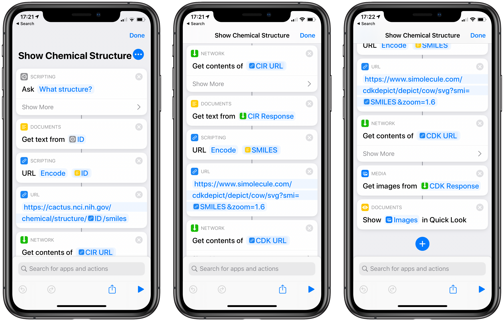

Apple provides a way to add custom abilities to Siri using the [Shortcuts app](https://apps.apple.com/us/app/shortcuts/id915249334), which has been available since iOS 12. Shortcuts is a sort of visual scripting environment that allows you to build workflows and automations by combining multiple building blocks called "actions".

I was a little surprised to learn that there are shortcut actions to perform quite advanced tasks like making HTTP requests to REST APIs and parsing JSON responses. This got me thinking about which web services I could make use of via Siri.

For a cheminformatics application, I thought that showing a 2D depiction of a chemical structure for a given chemical name or identifier would be a nice first example. Here's a GIF of what I came up with in action:


This simple shortcut can be broken down into four main stages: Obtaining the chemical name input from the user, chemical name to structure conversion (via a web service), 2D structure depiction (via a web service), and, finally, showing the final output to the user.

Here's a screenshot of the shortcut in full:

{.large}

## Getting the Input

When you create a shortcut, its name is automatically added to Siri as a trigger phrase — in this case, "Show Chemical Structure". I don't believe you can pass variables through to the shortcut from your original invocation with Siri — it has to be a fixed phrase. But there is an "Ask for input" action that causes Siri to immediately ask follow up questions.

Unfortunately, Siri seems to struggle with interpreting some chemical names — trade names and common names definitely seem to work best. Alternatively, it is possible to invoke shortcuts by [tapping a button in a widget](https://support.apple.com/en-us/HT207122), in which case the "Ask for input" action will present a text field to type the input. But that is much less fun than chatting with Siri!

## Name to Structure

I chose the [NCI Chemical Identifier Resolver](https://cactus.nci.nih.gov/chemical/structure) to perform the chemical name to structure conversion. It is probably the best public web service for taking a chemical name or identifier and converting it into a variety of machine-readable chemical formats, including SMILES.

Using it is simply a case of URL-encoding the name input, substituting it into the URL below, making a HTTP GET request to the URL, then getting the text content of the response.

```
https://cactus.nci.nih.gov/chemical/structure/{input}/smiles
```

Each of these tasks can be performed with a built-in action that you can find in the Shortcuts app.

## 2D Structure Depiction

The CDK (Chemistry Development Kit) has some of the best 2D depictions for molecules (and reactions) of any cheminformatics toolkit, and John Mayfield runs a public [CDK Depict web service](https://www.simolecule.com/cdkdepict/depict.html).

We can make use of it in much the same way as the identifier resolver. We URL-encode the SMILES, substitute it into the URL below, then make a HTTP GET request to the URL. Only this time, we get the image content from the response instead of text.

```
https://www.simolecule.com/cdkdepict/depict/cow/svg?smi={smiles}&zoom=1.6
```

## Showing the Output

There are a variety of tasks that can be performed with the structure image, such as saving it to the camera roll. I think the most flexible option is the "Quick Look" action, which can take any kind of file input. In this case, it shows the 2D chemical depiction on the screen (for a *quick look*...) alongside a share button to optionally save the image or send it to another app.

## Next Steps

For someone who is used to writing lines of code, it can sometimes feel a bit clunky to put together a tool like this using a visual editor. But it is undoubtedly much more user-friendly for beginners and a great way to build quick prototypes.

You can [download my example shortcut here](https://www.icloud.com/shortcuts/7f50565e12f0426aa4200b069b231d88), and use it as a starting point for building other shortcuts that enable Siri to perform cheminformatics tasks. Let me know via [Twitter](https://twitter.com/mattswain123) if you come up with anything you'd like to share.

For an additional example, check out this blog post by Craig Callum, which shows how to [trigger KNIME workflows with Siri](https://medium.com/@craigcullum/hey-siri-run-my-knime-workflow-b7da176ee243). It includes more details about how to parse a JSON response from a web service, a common task that wasn't needed for my simple example.

Finally, it is worth noting that third-party apps on the App Store can provide custom actions for shortcuts that can run code natively on the device, potentially removing the need to call out to public web services for these sorts of tasks. If any iOS developers already have apps that include a cheminformatics toolkit, it would be great to see that functionality made available in Shortcuts.


